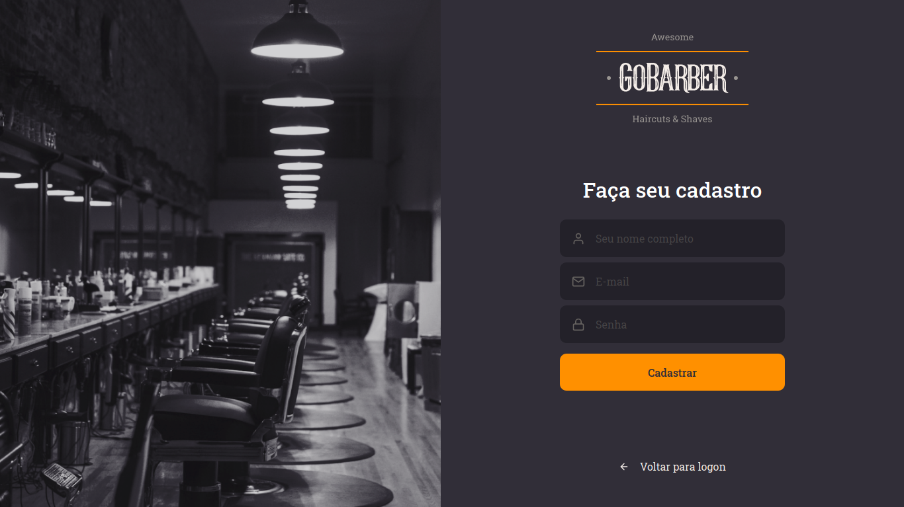

# GoBarber 💇🧔

### _Platform for registering **Barber Shop professionals** and **consumers interested** in their services._
 
Full-stack application developed during GoStack Bootcamp by <a href="https://www.rocketseat.com.br">Rocketseat</a>.

<strong>Currently working on finishing the application backend.</strong>

 
Application initial screen (design by Rocketseat).

## Built with

- Typescript
- Node.js
- React
- React Native (coming soon)
- PostgreSQL
- MongoDB

## Main libraries used so far

- Express
- Axios
- TypeORM
- Styled-components
- React Icons
- Polished
- Unform
- Yup
- Multer
- Nodemailer
- Tsyringe

## Requirements

- Node.js installed
- ESLint editor plugin
- Docker container with PostgreSQL
- Docker container with MongoDB
- Yarn

## License

This project is under the terms of <a href="https://opensource.org/licenses/MIT">MIT</a> license.
